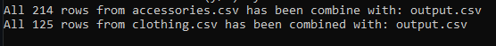

# CSV Combiner
CSV Combiner makes it possible to merge N-number of csv file(s) into one output file

## Languages used 
* Standard Java 13.0.1
* No external dependencies

## First time using
Compile with javac version 13.0.1+ 
```
$ javac CSVCombine.java
```

## Running the program
``` 
$ java CSVCombine [Input Filepath One] [Input Filepath Two] [Input FilePath n...] [Output Filename]
```
* Input Filepath: "./foldername/filename.csv"
* Output FileName: "outputname.csv"
* Up to N input files allowed
* Only one output file allowed 
* !The last argument passed will be the output file!

## Example
```
$ java CSVCombine ./fixtures/accessories.csv ./fixtures/clothing.csv output.csv
```
* Will be prompted with a confirmation window displaying the input files and output file
  * enter 'y' to proceed 
  * enter 'n' to cancel
  

* After Entering ‘y’
 
 
 ## Result
 Ten lines from output.csv
 
 email_hash  | category | filename
------------- | ------------- | -------------
Content Cell  | Content Cell  |
Content Cell  | Content Cell  |
