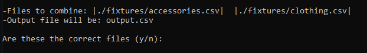
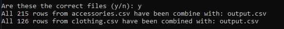

# CSV Combiner
CSV Combiner makes it possible to merge N-number of csv file(s) into one output file

## Languages used 
* Standard Java 13.0.1
* No external dependencies

## First time using
Compile with javac version 13.0.1+ 
```
$ javac CSVCombine.java
```

## Running the program
``` 
$ java CSVCombine [Input Filepath One] [Input Filepath Two] [Input FilePath n...] [Output Filename]
```
* Input Filepath: "./foldername/filename.csv"
* Output FileName: "outputname.csv"
* Up to N input files allowed
* Only one output file allowed 
* !The last argument passed will be the output file!

## Example
```
$ java CSVCombine ./fixtures/accessories.csv ./fixtures/clothing.csv output.csv
```
* Will be prompted with a confirmation window displaying the input files and output file
  * enter 'y' to proceed 
  * enter 'n' to cancel
  

* After Entering ‘y’
 
 
 ## Result
 Four lines from output.csv
 
 email_hash  | category | filename
------------- | ------------- | -------------
b9f6f22276c919da793da65c76345ebb0b072257d12402107d09c89bc369a6b6  | Satchels | accessories.csv
c2b5fa9e09ef2464a2b9ed7e351a5e1499823083c057913c6995fdf4335c73e7  | Purses   | accessories.csv
587604aa941d462c7d6bc0da4181939374e8df5c3fca2dc1b3ea496268c81263  | Pants    | clothing.csv
c77325c0f8254e2baba043f1bf216b8aad4f940dc7ca6a41e711dc26d4b7832c  | Capris   | clothing.csv


